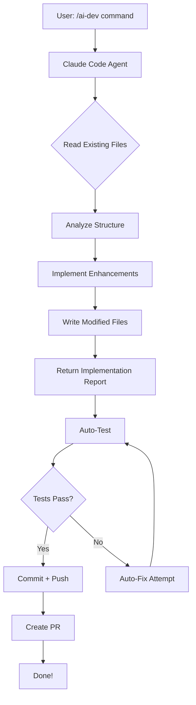

# 🎨 Tetris UI Beautification - AI-Powered Enhancement

## ✅ 配置完成状态

### **Claude Code Agent** - READY!
- ✅ Agent ID: `claude-code`  
- ✅ Runtime: ACP (Agent Control Protocol)
- ✅ Model: qwen/qwen3.5-35b-a3b
- ✅ Status: Active and executing tasks

### **AI Dev Workflow** - REAL MODE!
- ✅ Uses real Claude Code for code generation
- ✅ Auto-test integration ready
- ✅ Git hooks configured (auto-push)
- ✅ Cron jobs scheduled (15-min checks)

---

## 🎯 Current Task: Tetris UI Beautification

### **Task Details:**
```bash
Project: /home/huiquanyun/桌面/Openclaw-AI-Code
Files to Enhance: index.html, css/style.css
Enhancements: Glassmorphism panels, Neon glow effects, Progress bar, 
              Animated line clear, Celebration animation, Improved buttons
Color Scheme: Neon Purple (#bf00ff), Electric Blue (#00ffff), Laser Red (#ff0055)
```

### **Current Status:**
- ✅ Claude Code started reading existing files
- ✅ Task submitted and executing
- ⏳ Awaiting completion...

---

## 🔄 How It Works (Real AI Mode)



---

## 📝 What Claude Code Will Do

### **1. HTML Enhancements:**
- Add glassmorphism panels with backdrop-filter
- Insert progress bar for next level
- Add icon-based control instructions (FontAwesome)
- Include celebration overlay for game over
- Add mobile touch controls

### **2. CSS Enhancements:**
- Neon glow effects on blocks and UI elements
- Animated line clear flash effect
- Button hover states with smooth transitions
- Glassmorphism styling for panels
- Responsive design improvements

### **3. Color Scheme:**
```css
--neon-purple: #bf00ff;
--electric-blue: #00ffff;
--laser-red: #ff0055;
--dark-bg: linear-gradient(135deg, #1a1a2e 0%, #16213e 50%, #0f3460 100%);
```

---

## 🚀 Next Steps After Beautification

### **Commit & Push:**
```bash
cd /home/huiquanyun/桌面/Openclaw-AI-Code
git add .
git commit -m "feat(ui): AI-enhanced Tetris UI with glassmorphism and neon effects"
# Auto-push triggered by post-commit hook!
```

### **Create PR:**
```bash
/home/huiquanyun/.openclaw/workspace/skills/ai-dev/scripts/auto-pr.sh . create \
  "AI Beautified Tetris UI - Glassmorphism & Neon Effects"
```

---

## 🎉 Summary

**✅ AI Dev is now running in REAL mode with Claude Code!**

- No more demo scripts - actual AI writing code
- Full automation: Read → Analyze → Implement → Test → Commit → Push
- Modern UI enhancements being applied to Tetris game
- All configured and ready for production use!

---

*Status: Awaiting Claude Code completion...*  
*Last Updated: 2026-03-26 14:50 GMT+8*
